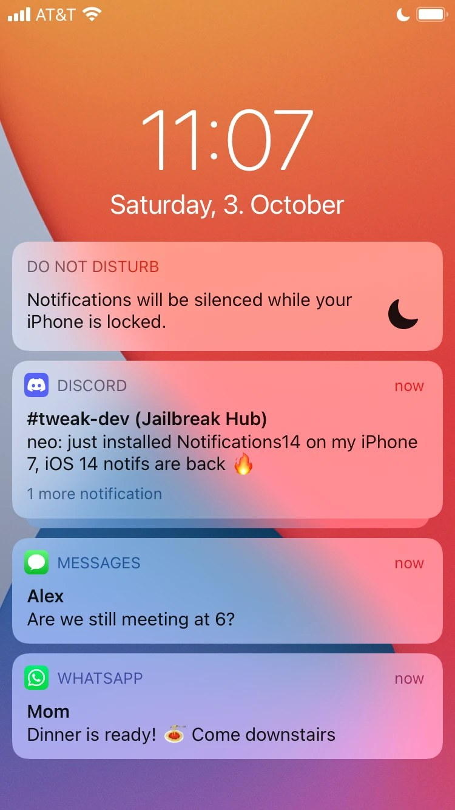
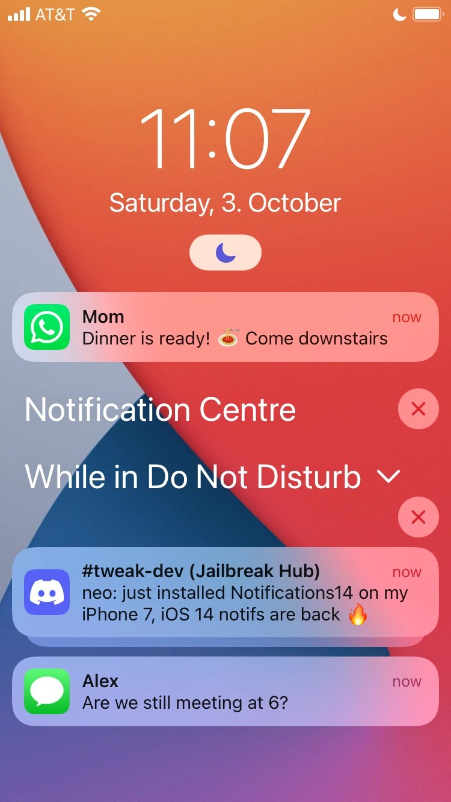

# Notifications14

Brings back the **iOS 14 notification design on iOS 15**.

iOS 15 still ships the old iOS 14 notification code; the redesign is switched on by one of Apple's feature flags (`Kettle` → `FeatureComplete`). Notifications14 turns that flag off for SpringBoard only. No system files are changed: uninstall the tweak and everything is back to iOS 15.

<p align="center">
  
  &nbsp;&nbsp;
  
</p>
<p align="center"><sub>With Notifications14 (iOS 14 style) · Without (iOS 15)</sub></p>

## What changes

- Notifications on the lock screen, in Notification Center and as banners look like on iOS 14
- Do Not Disturb / Focus shows iOS 14's card ("Notifications will be silenced while your iPhone is locked") instead of iOS 15's Focus pill
- Everything that belongs to the same switch in iOS goes back to iOS 14 with it; there are no separate options

## Compatibility

- **iOS 15.0 – 15.8**, rootless and rootful jailbreaks
- **Not iOS 16 and later:** Apple removed the iOS 14 code there, so the tweak does nothing

Problems on your device? Please [open an issue](../../issues) with your model, iOS version and jailbreak.

## Installation

Download the right `.deb` from the [latest release](../../releases/latest) and open it with Sileo, Zebra or Filza, then respring:

- **Rootless** (Dopamine, palera1n rootless): `Notifications14_1.0_rootless.deb`
- **Rootful** (palera1n rootful, checkra1n and other rootful jailbreaks): `Notifications14_1.0_rootful.deb`

Not sure which one you have? If your jailbreak keeps its files in `/var/jb`, it's rootless.

## Building from source

You need [Theos](https://theos.dev).

```bash
git clone https://github.com/aronsz26/Notifications14.git
cd Notifications14
export THEOS=~/theos
make package FINALPACKAGE=1             # rootless
make clean
make package FINALPACKAGE=1 ROOTFUL=1   # rootful
```

## Credits

Thanks to u/aqua95_ on Reddit for pointing out the `Kettle` flag.

## License

MIT, see [LICENSE](LICENSE).
